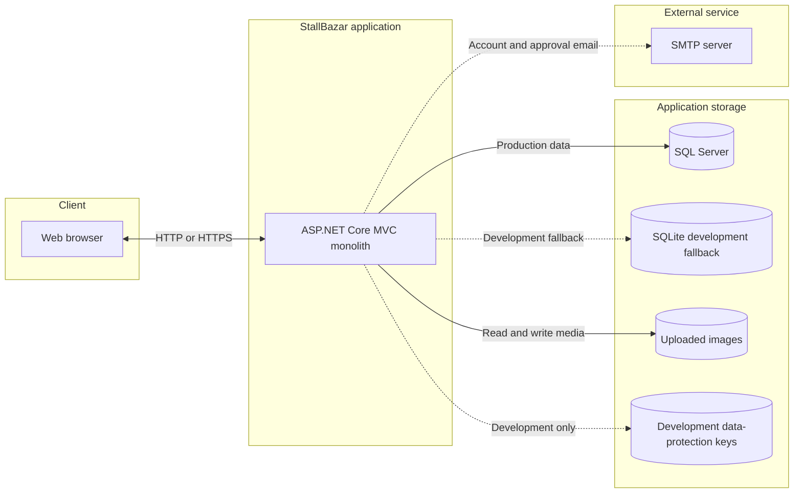
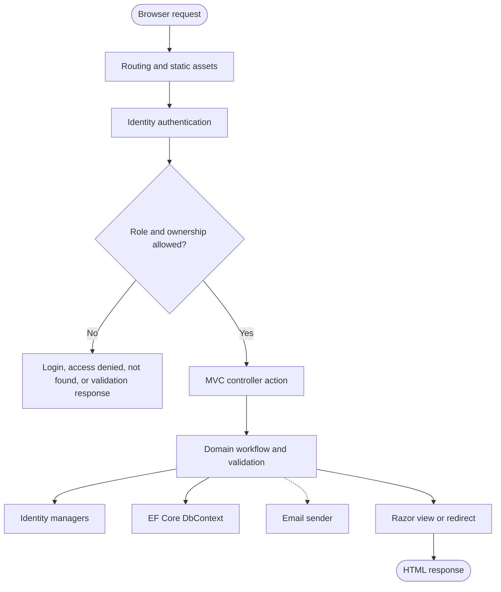
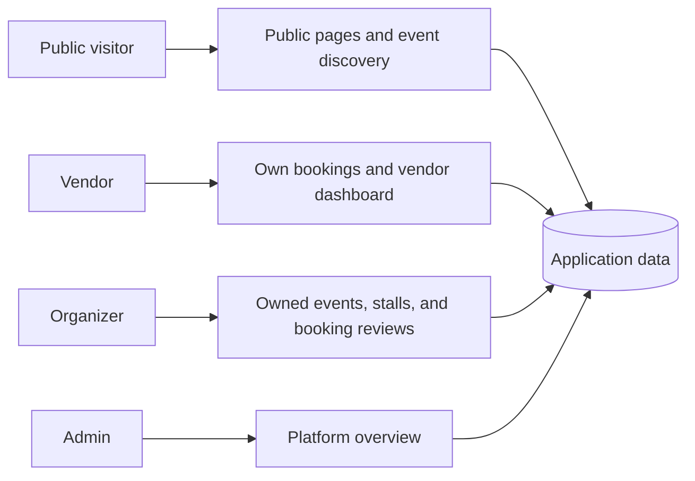

# System architecture

## Architecture summary

StallBazar is a modular monolith: one ASP.NET Core MVC process contains routing, authentication, authorization, controllers, domain workflow, Razor rendering, and database access. It is deployed as one unit and uses relational storage plus local uploaded-file storage. SMTP is the only external service integration.

## Runtime topology

Only one relational provider is active per process:

- Development tries the configured SQL Server with a two-second connection timeout. If it cannot connect, the application uses `stallbazar-dev.db` through SQLite.
- Non-development environments use the configured SQL Server connection.

## Internal layers

### Presentation layer

- Razor views in `Views/` render the public site, account screens, event pages, dashboards, review screens, and forms.
- `_Layout.cshtml` changes navigation by authentication state and role.
- `wwwroot/css/site.css` and `experience.css` provide custom design; Bootstrap provides base responsive components.
- `wwwroot/js/site.js` supplies client-side interactions. Business authorization remains server-side.

### Application layer

- Controllers accept requests, enforce role attributes, query ownership, validate workflow state, and return views or redirects.
- View models isolate form/dashboard composition from persistence entities.
- `IEmailSender` abstracts account and approval email delivery.

### Identity and security layer

- ASP.NET Core Identity stores users, roles, passwords, tokens, claims, logins, and role membership.
- Cookie authentication redirects unauthenticated users to `/Account/Login` and forbidden users to `/Account/AccessDenied`.
- Confirmed email and unique email are required.
- State-changing MVC actions use anti-forgery validation.
- Ownership checks intentionally return `NotFound` for another organizer/vendor's record, avoiding record disclosure.

### Persistence layer

- `ApplicationDbContext` extends `IdentityDbContext<ApplicationUser>`.
- EF Core maps events, stalls, bookings, notifications, and standard Identity tables.
- Relationships use restrictive deletes for user/event/booking links, cascade delete for event-to-stall and user-to-notification, and decimal precision configuration.
- Startup calls `EnsureCreatedAsync`, seeds roles/demo users/sample event data, and applies limited SQL Server schema guards.

## Request ownership boundaries

## Deployment and storage concerns

- The application is stateful with respect to local uploaded files and, in development, data-protection keys. Multiple instances would require shared media/key storage.
- SMTP delivery occurs during the request. Slow or unavailable SMTP can lengthen the response, although delivery exceptions are logged and swallowed.
- Production enables HSTS, exception handling, and HTTPS redirection. Development does not force HTTPS in `Program.cs`.
- There is no background worker, message broker, cache, CDN configuration, or payment-gateway integration.

## Key architecture decisions

| Decision | Benefit | Tradeoff |
| --- | --- | --- |
| Modular monolith | Simple deployment and transaction boundaries | Web, email, and workflow load scale together |
| Server-rendered MVC | Straightforward role-secured forms and low frontend complexity | Less interactive than a client-side application |
| EF Core with two providers | SQL Server target plus easy local startup | Provider differences need explicit testing |
| Local image storage | Minimal setup | Not suitable for stateless multi-instance hosting |
| Identity roles and ownership filters | Clear access boundaries | Ownership logic must remain consistent across actions |
| Conditional database updates | Prevents common double-booking races | Requires relational provider behavior and concurrency tests |

## Security configuration note

SMTP credentials and production connection values must be supplied through environment variables, .NET User Secrets, or a deployment secret store. They should not be committed to `appsettings.json`. Any credential already committed should be rotated.
