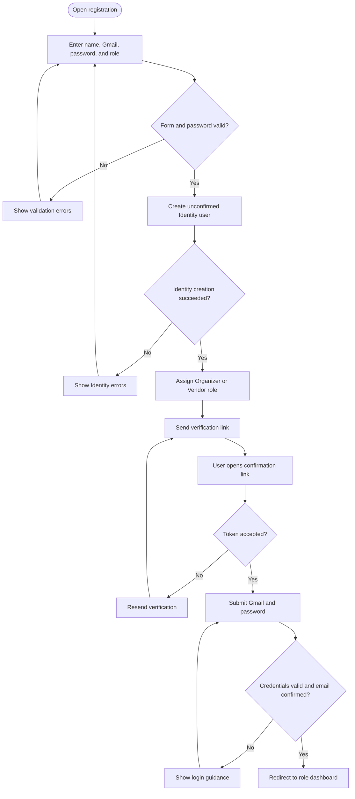
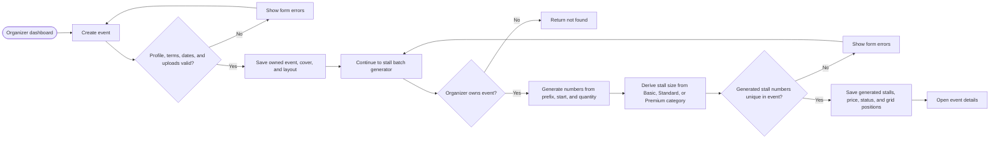
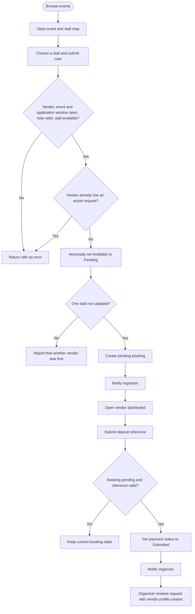
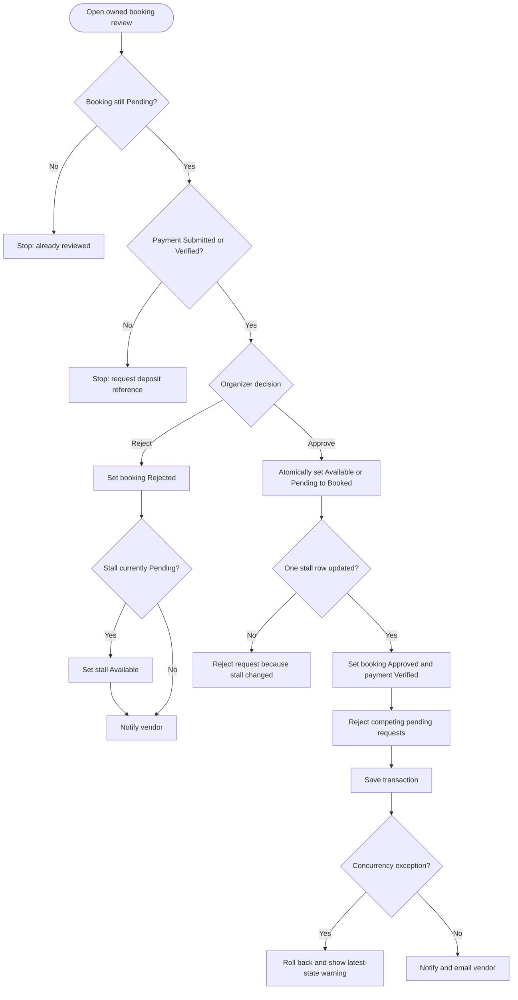
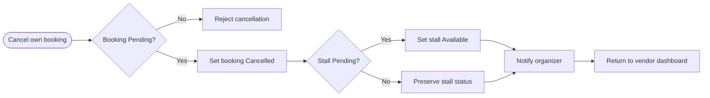

# Process flows

## 1. Registration and sign-in

Notes:

- Self-registration allows only Organizer or Vendor; any other posted role value becomes Vendor.
- Account form validation accepts Gmail addresses only.
- Development can expose generated verification/reset links through temporary UI data for testing.

## 2. Organizer event and stall setup

Event profiles include an application deadline, expected attendance, vendor contact details, included facilities, vendor requirements, and cancellation terms. Event covers allow JPG, PNG, or WEBP up to 5 MB. Stall layout uploads allow JPG, PNG, WEBP, or PDF up to 5 MB. Stall creation no longer requires manual length and breadth entry; those values come from the selected category.

## 3. Vendor booking and deposit workflow

## 4. Organizer review and concurrency-safe approval

The approval guard is implemented as a conditional database update rather than a read-then-write sequence. This is the primary protection against duplicate confirmation.

## 5. Vendor cancellation

## 6. Status transition rules

### Stall

| From | To | Trigger |
| --- | --- | --- |
| `Available` | `Pending` | First successful vendor request claim |
| `Pending` | `Booked` | Organizer successfully approves a deposited request |
| `Pending` | `Available` | Pending request is rejected or cancelled |
| `Available` or `Pending` | `Booked` | Guarded approval update |
| Any | Organizer-selected status | Organizer edits the stall form |

### Booking

| From | To | Trigger |
| --- | --- | --- |
| New | `Pending` | Successful vendor request |
| `Pending` | `Approved` | Organizer approval after deposit submission |
| `Pending` | `Rejected` | Organizer rejection, conflicting approval, or lost availability |
| `Pending` | `Cancelled` | Vendor cancellation |

### Payment

| From | To | Trigger |
| --- | --- | --- |
| `NotSubmitted` | `Submitted` | Vendor supplies a valid reference |
| `Submitted` | `Verified` | Organizer verifies it or approves the booking |
| `Submitted` or `Verified` | `Rejected` | Organizer rejects payment while booking remains pending |

The model enum permits transitions beyond this table, but controller actions enforce the flows shown above.
