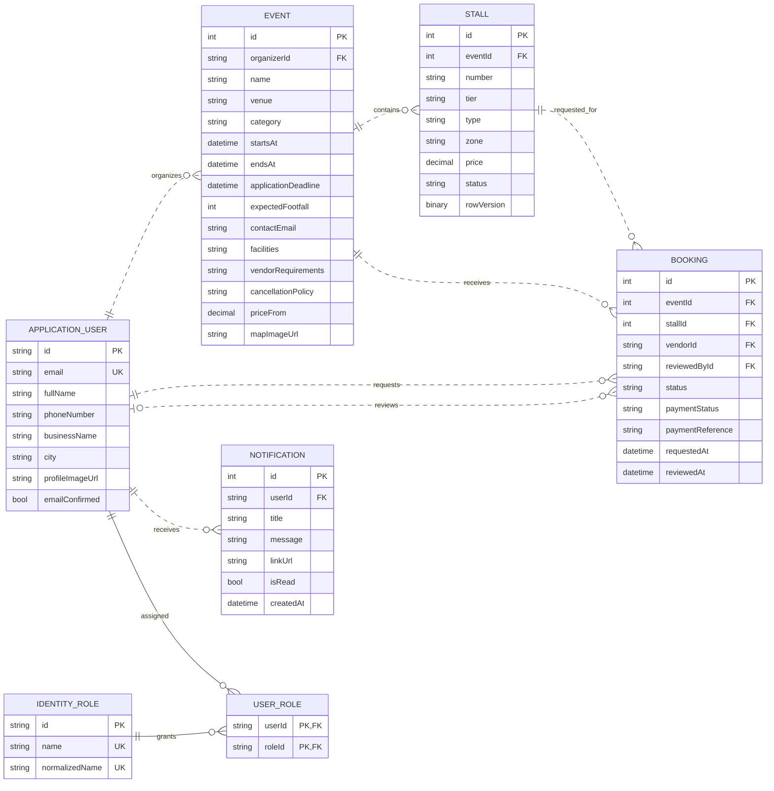

# Data model and ERD

## Core logical ERD

The diagram includes the business entities and the minimum Identity role structure needed to explain authorization. Standard Identity claim, login, token, and role-claim tables are intentionally omitted from the visual to keep the booking domain readable.

## Entity catalogue

### ApplicationUser

Extends the standard ASP.NET Core Identity user. In addition to the fields shown above, Identity supplies normalized email/user name, password hash, security and concurrency stamps, two-factor state, lockout state, and access-failure count.

Key constraints:

- `Id` is the string primary key inherited from Identity.
- Email is configured as unique.
- `FullName` is required, maximum 120 characters.
- Business, city, biography, and profile-image fields are optional.

### Event

Represents an organizer-owned event listing. It stores descriptive content, timing, application deadline, expected attendance, vendor contacts and terms, category, pricing, and image/map references.

- Required organizer relationship.
- `PriceFrom` precision is 10,2.
- Deleting an organizer is restricted while events reference that user.

### Stall

Represents one reservable space inside an event.

- Required event relationship.
- Stores display number/name, tier, type, zone, dimensions, price, status, and integer layout coordinates.
- `RowVersion` is configured as a database row-version concurrency token.
- Event deletion cascades to stalls.
- The controller enforces stall-number uniqueness per event, but the model configuration does not define a database unique index.

### Booking

Represents a vendor request for one stall, including workflow, deposit reference, notes, and review audit fields.

- Event, Stall, and Vendor are required relationships.
- Reviewer is optional until a review occurs.
- Delete behavior is restrictive for Event, Stall, Vendor, and Reviewer relationships.
- The model does not define a database unique constraint for active requests; workflow actions use validation plus atomic stall status updates.

### Notification

Stores an in-app message for one user with an optional internal link.

- User relationship is required.
- Deleting the user cascades to their notifications.
- Opening the notification inbox marks unread rows as read.

## Identity tables outside the core visual

`IdentityDbContext<ApplicationUser>` also creates the normal ASP.NET Identity schema:

- `AspNetUsers`
- `AspNetRoles`
- `AspNetUserRoles`
- `AspNetUserClaims`
- `AspNetUserLogins`
- `AspNetUserTokens`
- `AspNetRoleClaims`

The logical `APPLICATION_USER`, `IDENTITY_ROLE`, and `USER_ROLE` entities in the diagram correspond to the first three tables.

## Enum values

| Enum | Values |
| --- | --- |
| `StallStatus` | `Available`, `Pending`, `Booked`, `Unavailable` |
| `BookingStatus` | `Pending`, `Approved`, `Rejected`, `Cancelled` |
| `PaymentStatus` | `NotSubmitted`, `Submitted`, `Verified`, `Rejected` |

EF Core stores these enums as integers unless provider configuration is added to convert them to strings.

## Relationship and delete rules

| Parent | Child | Cardinality | Delete behavior |
| --- | --- | --- | --- |
| ApplicationUser | Event as Organizer | 1 to 0..N | Restrict |
| Event | Stall | 1 to 0..N | Cascade |
| Event | Booking | 1 to 0..N | Restrict |
| Stall | Booking | 1 to 0..N | Restrict |
| ApplicationUser | Booking as Vendor | 1 to 0..N | Restrict |
| ApplicationUser | Booking as Reviewer | 0..1 to 0..N | Restrict |
| ApplicationUser | Notification | 1 to 0..N | Cascade |
| ApplicationUser | IdentityRole | N to N through UserRole | Identity defaults |

## Recommended database hardening

These are design recommendations, not descriptions of current constraints:

- Add a unique index on `(EventId, Number)` for stall numbers.
- Use versioned EF Core migrations instead of relying only on `EnsureCreated` and schema-guard SQL.
- Define a filtered unique strategy if the database must enforce one active booking per stall independently of application status transitions.
- Add indexes for common queries: event start/end, event category, organizer ID, vendor ID, stall ID/status, booking status, and notification user/created date.
